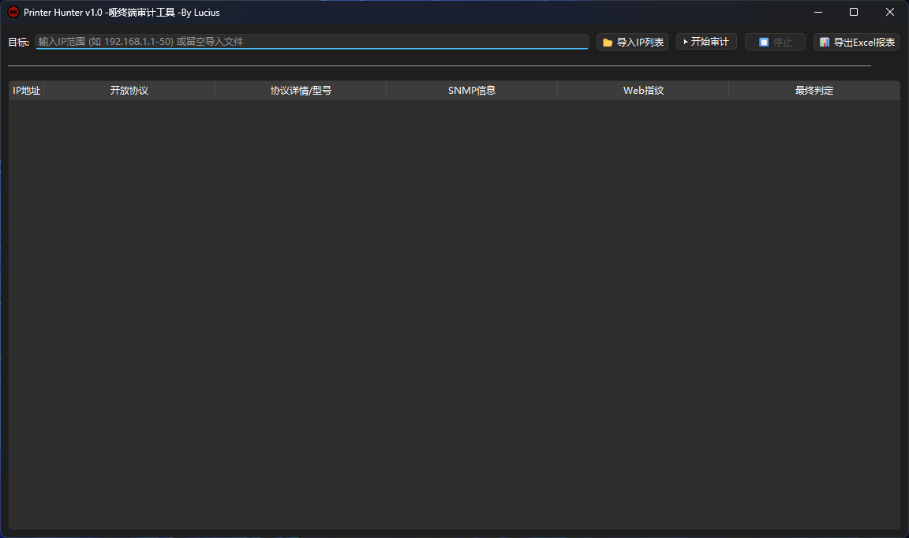
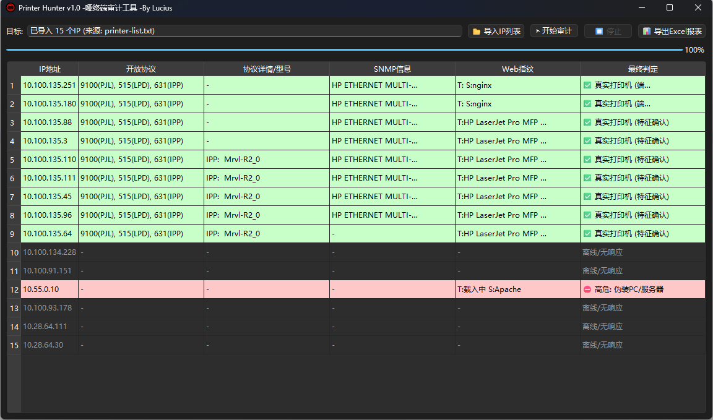
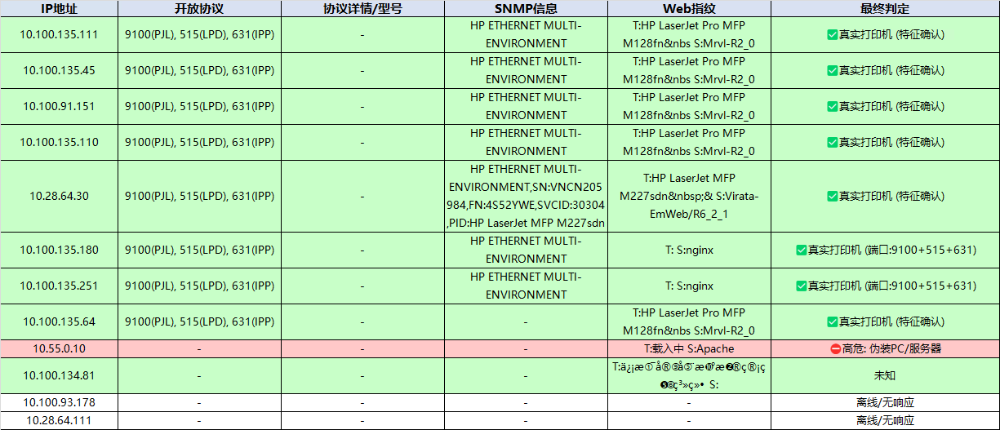

# 🎯 Printer Hunter (哑终端/打印机真实性审计工具)

**Printer Hunter** 是一款免安装、开箱即用的内网哑终端安全审计工具。专为应对企业网络准入控制（NAC）场景下的“哑终端逃逸”威胁而设计，帮助安全运营和网络运维人员快速完成资产排查。

## 💡 背景与核心痛点

在企业网络架构中，打印机等“哑终端”通常无法使用 802.1X 等强认证。为了保障业务，准入系统（NAC）往往基于 MAC OUI 或 DHCP 指纹为这类设备配置“免认证白名单”。

**安全威胁**：违规员工或攻击者极易通过修改 PC/服务器的 MAC 地址，将其伪装成“打印机”，从而兵不血刃地绕过准入策略，潜入内网。传统的端口扫描工具（如 Nmap）难以直观、快速地在大批量 IP 中锁定这些“披着羊皮的狼”。

本工具通过**多协议深度指纹交叉验证**，直接拆穿伪装，精准揪出潜伏在哑终端白名单中的违规主机。

## ✨ 核心特性

- ⚡ **开箱即用**：单文件 `.exe` 绿色发行版，无运行库依赖，双击即运行。
- 🚀 **极速并发引擎**：内置多线程异步扫描，轻松应对成百上千个 IP 的批量合规审计。
- 🕵️‍♂️ **多维指纹识别**：全面覆盖主流打印机协议栈，拒绝单一特征误报：
  - **JetDirect (9100)**: 发送 PJL 协议指令提取底层硬件型号。
  - **LPD (515)**: 探测经典 UNIX 打印守护进程交互。
  - **IPP/HTTP (631/80)**: 解析 Web 管理界面 Title 与 Server 特征。
  - **SNMP (161)**: 读取 `sysDescr` 操作系统级指纹（自适应高延迟网络）。
- 🛡️ **底层存活兜底**：针对开启了高级防火墙（全端口屏蔽）的“隐形主机”，提供 `ICMP Ping` 与同网段 `ARP` MAC 地址解析兜底探测，只要存活必留痕迹。
- 📊 **专业运营报表**：一键导出带有多彩风险等级标注（安全绿、疑似黄、高危红、离线灰）的 Excel (.xlsx) 审计报告，无缝对接安全运营 SLA 与治理汇报。

## 🧠 风险判定逻辑 (颜色图例)

工具内置了严格的降级判定逻辑，结果一目了然：

| 颜色 | 风险等级 | 判定依据与说明 | 处置建议 |
| :--- | :--- | :--- | :--- |
| 🟢 **绿色** | **真实打印机** | 在 PJL/SNMP/Web 响应中提取到 `HP`, `Canon` 等明确特征；或开放了打印专属端口且无任何 PC 特征。 | **安全放行**。确认为合法打印设备。 |
| 🔴 **红色** | **高危伪装 PC** | 在指纹中发现了 `Windows`, `Linux`, `IIS`, `Apache` 等非打印机特征；或**端口全关但 Ping/ARP 探测存活**。 | **立即封禁隔离**。极大概率为绕过准入的伪装终端。 |
| 🟡 **黄色** | **疑似设备** | 开放了 9100/515/631 端口，但拒绝建立协议级交互，无有效回显数据。 | **人工复核**。可能是老旧打印机或端口监听脚本。 |
| ⚪ **灰色** | **离线/无响应** | 目标未开放相关端口，且 Ping/ARP 均无响应。 | **忽略**。 |

## 🚀 快速开始

### 1. 下载工具
在 [Releases](https://github.com/YourUsername/PrinterHunter/releases) 页面下载最新版本的 `PrinterHunter_v1.0.zip`。解压后即可得到 `PrinterHunter_v1.0.exe`。

### 2. 准备审计目标
* **直接输入**：在工具顶部输入框填写 IP 段（如 `192.168.1.1-192.168.1.254`）。
* **文件导入**：从您的 NAC 或资产管理系统中导出“打印机”设备列表，保存为 `.txt` 或 `.csv`（只需包含 IP 即可），点击“📂 导入IP列表”加载。
* ## 📸 运行截图

*图：Printer Hunter 多线程扫描与风险高亮预警界面*

### 3. 执行审计与导出
* 点击 **“▶ 开始审计”**，等待进度条完成。
* 点击 **“📊 导出Excel报表”**，获取带有完整格式与颜色预警的审计清单。
* ## 📸 导出截图

## ⚠️ 常见限制说明

* **SNMP 探测失败**：如果大批量打印机无法获取 SNMP 描述，通常是因为跨网段的 UDP 防火墙拦截，或设备未采用默认的 `public` 团体名。
* **隐形主机探测 (ARP)**：基于底层二层协议的 ARP 探测无法穿透路由器。如果要实现最高强度的“隐形防逃逸探测”，建议将运行本工具的终端接入目标 IP 所在的同一局域网（VLAN）。

## 🛡️ 免责声明

本工具仅供企业内部网络安全人员、系统管理员进行合法合规的资产盘点与安全防守使用。请在获得授权的网络环境中运行。任何未经授权的探测行为引发的法律后果，由使用者自行承担。

# 🎯 Printer Hunter

**Printer Hunter** is a lightweight, highly concurrent network auditing tool designed to detect "dumb terminal spoofing" in Enterprise Network Access Control (NAC) environments.

## 💡 The Problem

In enterprise networks, "dumb terminals" like printers often lack 802.1X authentication capabilities. To maintain business operations, NAC systems frequently whitelist these devices based on MAC OUI or DHCP fingerprints. 

**The Threat:** Attackers or non-compliant users can easily bypass NAC policies by spoofing a printer's MAC address on their personal PC or server. Printer Hunter exposes these disguised hosts through deep multi-protocol fingerprinting.

## ✨ Core Features

- 🕵️‍♂️ **Multi-Protocol Fingerprinting**: Validates targets across multiple print-specific protocols rather than relying on a single port:
  - **JetDirect (9100)**: Extracts hardware IDs via PJL commands.
  - **LPD (515)**: Interacts with UNIX line printer daemons.
  - **IPP/HTTP (631/80)**: Parses Web UI titles and Server headers.
  - **SNMP (161)**: Reads `sysDescr` for OS-level fingerprints (supports v1/v2c fallback).
- 🛡️ **Stealth Host Detection**: Uses ICMP Ping and local ARP resolution to expose firewalled PCs that drop all TCP/UDP traffic but remain active on the network.
- 🚀 **High Performance**: Built-in concurrent scanning engine easily handles large subnets.
- 📊 **Actionable Reporting**: One-click export to Excel (`.xlsx`) with color-coded risk levels:
  - 🟢 **Green (Safe)**: Genuine printer signatures confirmed.
  - 🟡 **Yellow (Suspicious)**: Ports open, but no valid data returned.
  - 🔴 **Red (High Risk)**: PC/Server OS detected, or stealth host actively dropping packets.

## 🚀 Quick Start

Download the standalone `.exe` from the [Releases](https://github.com/YourUsername/PrinterHunter/releases) page. No installation or dependencies required.
